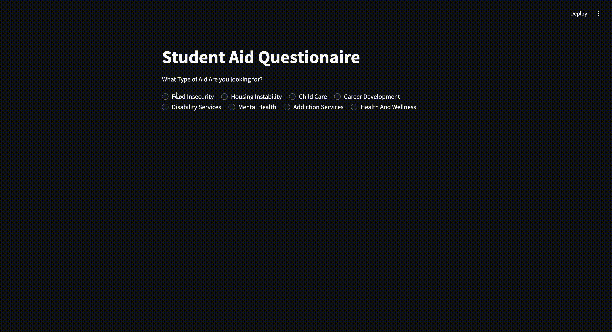

# CTP_Hack: CUNY Student Resource Questionnaire by Team 0001

## App Description and Features:

Our project aims to assist CUNY students in finding essential resources by having them complete a brief questionnaire detailing the type of aid they need. Based on their responses and the specific CUNY college they attend, the system provides tailored links, contacts, phone numbers, and more to relevant support services, making it easier for students to access the resources they need.

We used Streamlit, an open-source Python framework, to host our questionnaires on website. The questionnaires are user-friendly, where users simply have to select what college they attend and what type of aid is required.

## App Gifs:

#### Food Insecurity Services Walkthrough:

#### Housing Instability Services Walkthrough:

#### Child Care Services Walkthrough:

#### Career Development Services Walkthrough:

#### Disability Services Walkthrough:

#### Mental Health Services Walkthrough:

#### Addiction Services Walkthrough:

#### Health & Wellness Services Walkthrough:

## Presentation:

[Powerpoint](https://docs.google.com/presentation/d/1P798ktTTBiFoBrsFoe3SscNlgFK0MUH1k0dd30z1IwI/edit#slide=id.g2f555cf5034_0_52)

Created by Rahib Khandaker, Jasminder Garcha, Anthony Jerez, and Lauren Ramroop
